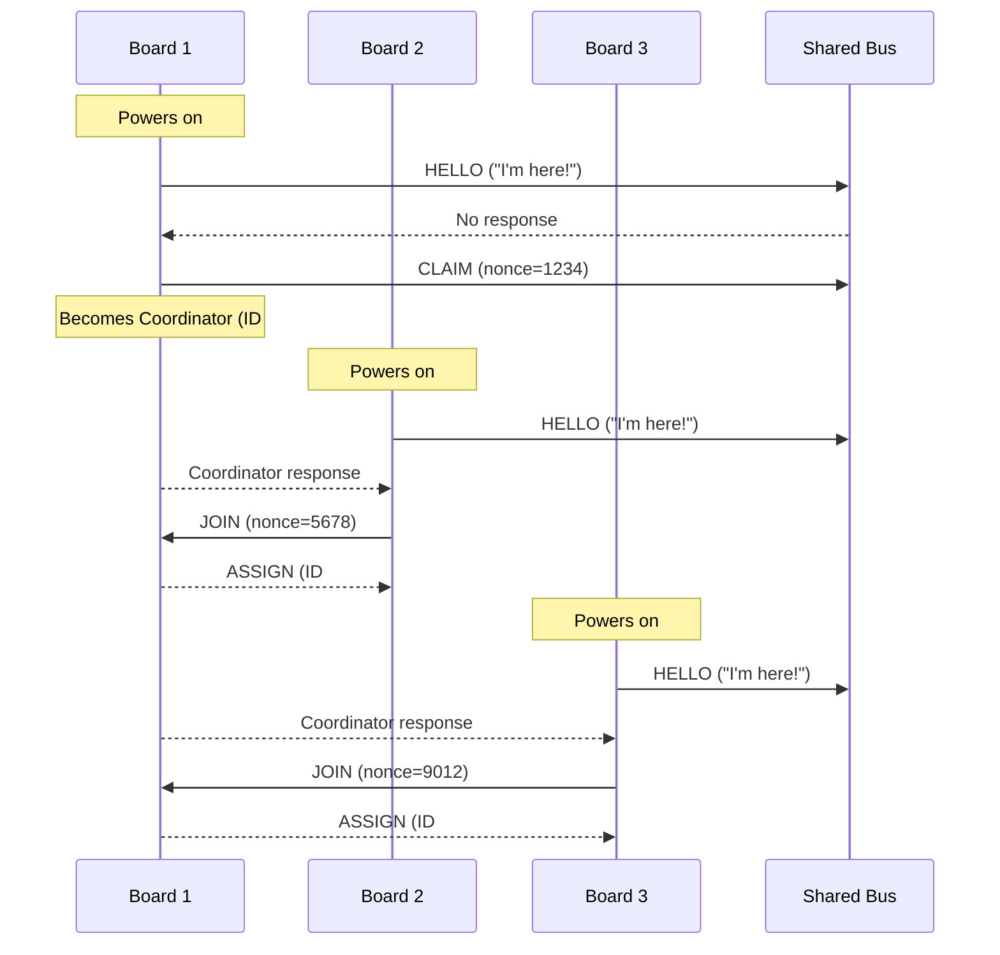

## Startup Sequence Diagram

```mermaid
sequenceDiagram
    participant B1 as Board 1
    participant B2 as Board 2
    participant B3 as Board 3
    participant Bus as Shared Bus

    Note over B1: Powers on
    B1->>Bus: HELLO ("I'm here!")
    Bus-->>B1: No response
    B1->>Bus: CLAIM (nonce=1234)
    Note over B1: Becomes Coordinator (ID #1)

    Note over B2: Powers on
    B2->>Bus: HELLO ("I'm here!")
    B1-->>B2: Coordinator response
    B2->>B1: JOIN (nonce=5678)
    B1-->>B2: ASSIGN (ID #2, nonce=5678)

    Note over B3: Powers on
    B3->>Bus: HELLO ("I'm here!")
    B1-->>B3: Coordinator response
    B3->>B1: JOIN (nonce=9012)
    B1-->>B3: ASSIGN (ID #3, nonce=9012)
```