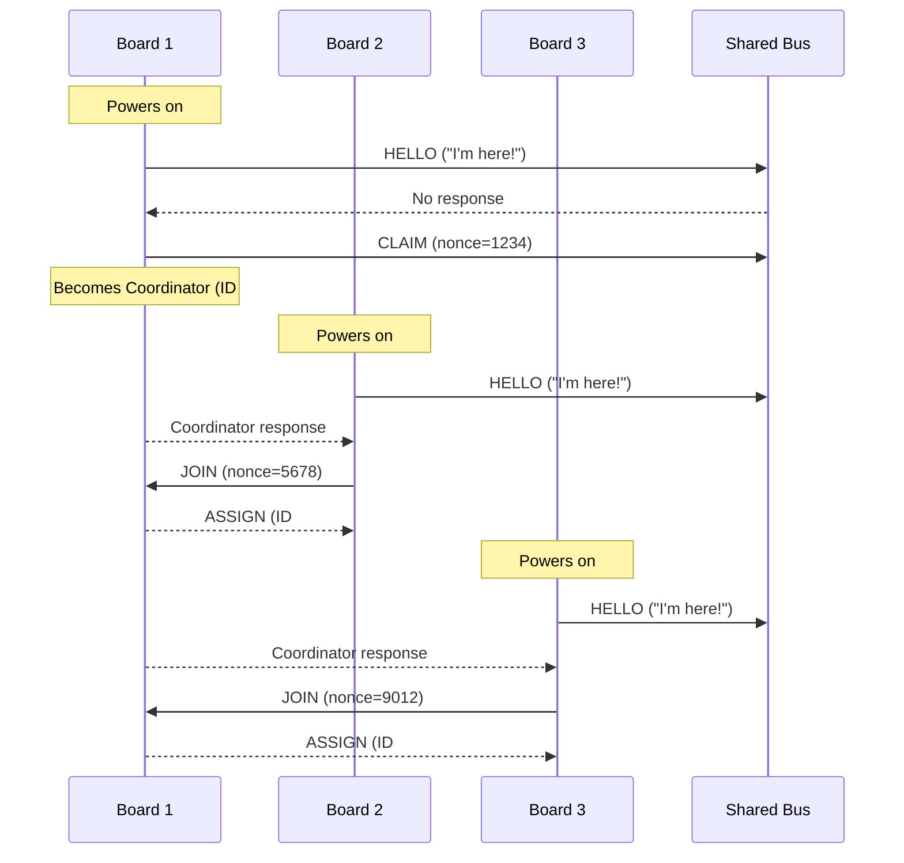

## Startup Sequence Diagram


## Hardware Wiring Diagrams

### Arduino UNO + UNO (SoftwareSerial)
```
    Arduino UNO A                Arduino UNO B
   ┌─────────┐                  ┌─────────┐
   │         │                  │         │
   │   TX(11)├─────────────────►│RX(10)   │
   │         │                  │         │
   │   RX(10)│◄─────────────────┤TX(11)   │
   │         │                  │         │
   │     GND ├──────────────────┤GND      │
   │         │                  │         │
   │    5V/USB                  │5V/USB   │
   └─────────┘                  └─────────┘
        │                           │
     USB Cable                   USB Cable
     (to PC)                     (to PC)
```

### Arduino UNO + R4 WiFi (Mixed Setup)
```
    Arduino UNO                  Arduino R4 WiFi
   ┌─────────┐                  ┌─────────┐
   │         │                  │         │
   │   TX(11)├─────────────────►│RX(0)    │
   │         │                  │         │
   │   RX(10)│◄─────────────────┤TX(1)    │
   │         │                  │         │
   │     GND ├──────────────────┤GND      │
   │         │                  │         │
   │    5V/USB                  │5V/USB   │
   └─────────┘                  └─────────┘
        │                           │
     USB Cable                   USB Cable
     (to PC)                     (to PC)
```

### Arduino R4 WiFi + R4 WiFi (HardwareSerial)
```
    Arduino R4 WiFi A            Arduino R4 WiFi B
   ┌─────────┐                  ┌─────────┐
   │         │                  │         │
   │    TX(1)├─────────────────►│RX(0)    │
   │         │                  │         │
   │    RX(0)│◄─────────────────┤TX(1)    │
   │         │                  │         │
   │     GND ├──────────────────┤GND      │
   │         │                  │         │
   │    5V/USB                  │5V/USB   │
   └─────────┘                  └─────────┘
        │                           │
     USB Cable                   USB Cable
     (to PC)                     (to PC)
```

### Pin Configuration Summary
- **Arduino UNO:** Uses SoftwareSerial on pins 10 (RX) and 11 (TX)
- **Arduino R4 WiFi:** Uses HardwareSerial1 on pins 0 (RX) and 1 (TX)
- **Mixed Setup:** UNO pins 10/11 connect to R4 pins 0/1 respectively