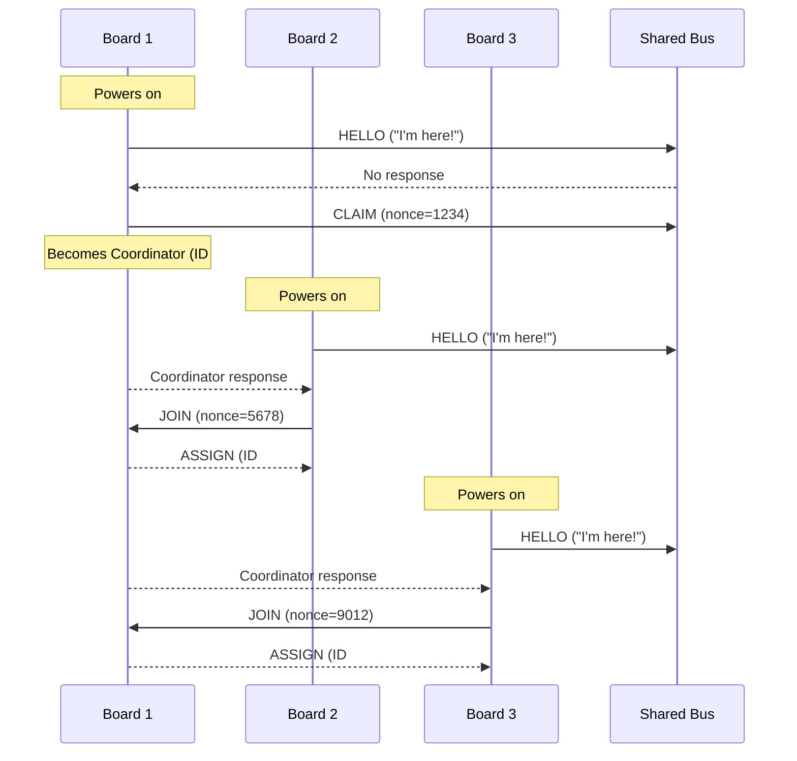

## Startup Sequence Diagram


## Hardware Wiring Diagrams

### Arduino UNO + UNO (SoftwareSerial)
```
    Arduino UNO A                Arduino UNO B
   ┌─────────┐                  ┌─────────┐
   │         │                  │         │
   │   TX(11)├─────────────────►│RX(10)   │
   │         │                  │         │
   │   RX(10)│◄─────────────────┤TX(11)   │
   │         │                  │         │
   │     GND ├──────────────────┤GND      │
   │         │                  │         │
   │    5V/USB                  │5V/USB   │
   └─────────┘                  └─────────┘
        │                           │
     USB Cable                   USB Cable
     (to PC)                     (to PC)
```

### Arduino UNO + R4 WiFi (Mixed Setup)
```
    Arduino UNO                  Arduino R4 WiFi
   ┌─────────┐                  ┌─────────┐
   │         │                  │         │
   │   TX(11)├─────────────────►│RX(0)    │
   │         │                  │         │
   │   RX(10)│◄─────────────────┤TX(1)    │
   │         │                  │         │
   │     GND ├──────────────────┤GND      │
   │         │                  │         │
   │    5V/USB                  │5V/USB   │
   └─────────┘                  └─────────┘
        │                           │
     USB Cable                   USB Cable
     (to PC)                     (to PC)
```

### Arduino R4 WiFi + R4 WiFi (HardwareSerial)
```
    Arduino R4 WiFi A            Arduino R4 WiFi B
   ┌─────────┐                  ┌─────────┐
   │         │                  │         │
   │    TX(1)├─────────────────►│RX(0)    │
   │         │                  │         │
   │    RX(0)│◄─────────────────┤TX(1)    │
   │         │                  │         │
   │     GND ├──────────────────┤GND      │
   │         │                  │         │
   │    5V/USB                  │5V/USB   │
   └─────────┘                  └─────────┘
        │                           │
     USB Cable                   USB Cable
     (to PC)                     (to PC)
```

### ATmega328P + Arduino UNO (SoftwareSerial)
```
    ATmega328P (bare)               Arduino UNO
   ┌──────────┐                      ┌─────────┐
   │          │                      │         │
   │17(PB3/11)├─────────────────────►│RX(10)   │
   │          │                      │         │
   │16(PB2/10)│◄─────────────────────┤TX(11)   │
   │          │                      │         │
   │ 8,22(GND)├──────────────────────┤GND      │
   │          │                      │         │
   │  7(3.3V) │                      │5V/USB   │
   └──────────┘                      └─────────┘
        │                                │
    Atmel-ICE                        USB Cable
   (ISP Programmer)                   (to PC)
   
   Debug Serial: pins 2/3 @ 38400   Debug Serial: USB @ 38400
   Bus Serial:   pins 16/17 @ 4800  Bus Serial:   pins 10/11 @ 9600
                 (Arduino 10/11)
```

### Two ATmega328P Point-to-Point + Raspberry Pi Logging
```
    ATmega328P #1                              ATmega328P #2
   ┌──────────┐                               ┌──────────┐
   │          │                               │          │
   │17(PB3/TX)├──────────────────────────────►│16(PB2/RX)│ SoftwareSerial
   │          │                               │          │
   │16(PB2/RX)│◄──────────────────────────────┤17(PB3/TX)│ SoftwareSerial
   │          │                               │          │
   │ 8,22(GND)├───────────────┬───────────────┤8,22(GND) │ Common GND
   │          │               │               │          │
   │  7(3.3V) │               │               │ 7(3.3V)  │ Individual Power
   │          │               │               │          │
   │ 3(PD1/TX)├─────┐         │          ┌────┤3(PD1/TX) │ Debug Serial
   │ 2(PD0/RX)│     │         │          │    │2(PD0/RX) │
   └──────────┘     │         │          │    └──────────┘
        │           │         │          │         │
    Atmel-ICE       │         │          │      Atmel-ICE
                    │         │          │
                    │    Raspberry Pi    │
                    │   ┌─────────────┐  │
                    └──►│GPIO1(RX/28) │  │
                        │             │◄─┘
                        │GPIO5(RX/29) │
                        │             │
                        │  GND(pin6)  ├──┘
                        └─────────────┘

Point-to-Point Crossover:
- ATmega328P #1 Pin 17 (TX) → ATmega328P #2 Pin 16 (RX)
- ATmega328P #1 Pin 16 (RX) ← ATmega328P #2 Pin 17 (TX)

Debug Serial:
- ATmega328P #1 Pin 3 (TX) → Pi GPIO1 (Pin 28) → ttyAMA2
- ATmega328P #2 Pin 3 (TX) → Pi GPIO5 (Pin 29) → ttyAMA3

Power & Ground:
- Common GND: All Pin 8,22 → Pi Pin 6
- Individual 3.3V: Each Pin 7 → 3.3V supply
```

### Pi UART Configuration
Enable additional UARTs in `/boot/firmware/config.txt`:
```ini
enable_uart=1
dtoverlay=uart2
dtoverlay=uart3
```

| UART  | Device     | ATmega328P Pin | Pi GPIO | Pi Header Pin | Connection |
|-------|------------|----------------|---------|---------------|------------|
| uart2 | ttyAMA2    | Chip #1 Pin 3 (TX) | GPIO1 (RX) | Pin 28 | ATmega TX → Pi RX |
| uart3 | ttyAMA3    | Chip #2 Pin 3 (TX) | GPIO5 (RX) | Pin 29 | ATmega TX → Pi RX |
| GND   | Ground     | Both Chips Pin 8,22 | GND | Pin 6 | Common Ground |

### ATmega328P Programming (Atmel-ICE ISP)
```
    Atmel-ICE                        ATmega328P
   ┌─────────┐                      ┌─────────┐
   │         │                      │         │
   │   SCK   ├─────────────────────►│19 (SCK) │
   │         │                      │         │
   │   MISO  │◄─────────────────────┤18 (MISO)│
   │         │                      │         │
   │   MOSI  ├─────────────────────►│17 (MOSI)│
   │         │                      │         │
   │  nRESET ├─────────────────────►│1 (RESET)│
   │         │                      │         │
   │    VTG  ├─────────────────────►│7 (VCC)  │
   │         │                      │         │
   │    GND  ├──────────────────────┤8,22(GND)│
   └─────────┘                      └─────────┘
```

### Pin Configuration Summary
- **Arduino UNO:** Uses SoftwareSerial on pins 10 (RX) and 11 (TX)
- **Arduino R4 WiFi:** Uses HardwareSerial1 on pins 0 (RX) and 1 (TX)
- **ATmega328P:** Uses SoftwareSerial on pins 10 (RX) and 11 (TX), Hardware Serial on pins 0/1 for debug
- **Mixed Setup:** ATmega328P pins 10/11 connect to UNO pins 10/11 respectively